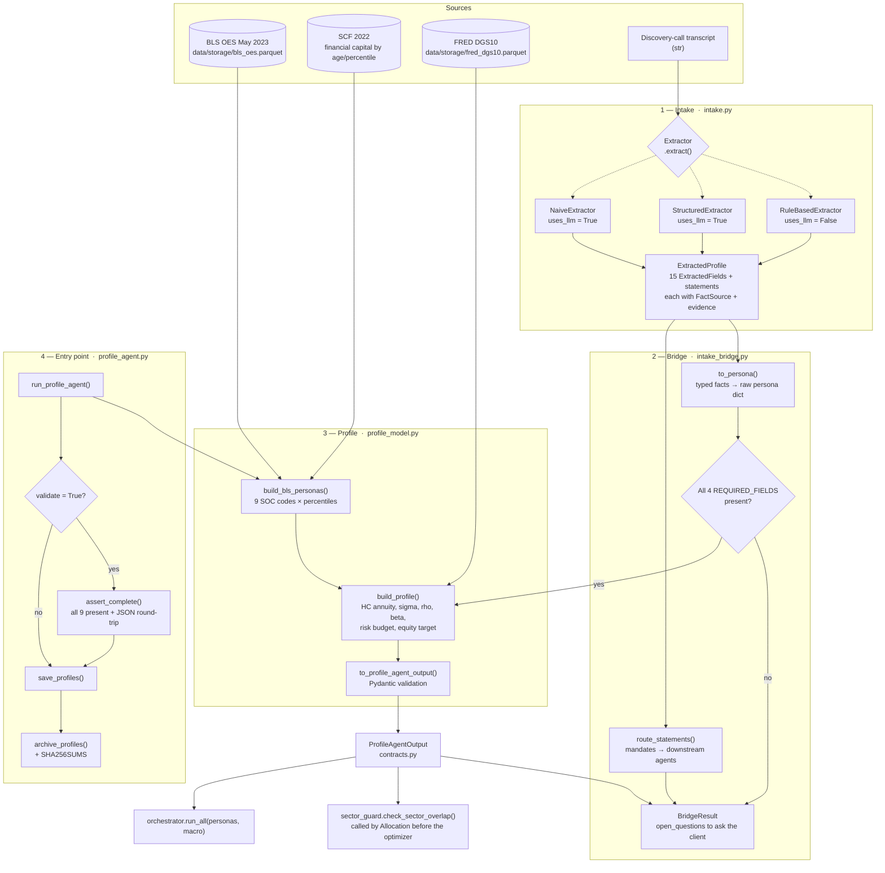

# Profile Agent — End-to-End Flow

**intake → bridge → profile**
*Fordham MSQF Capstone 2026 | Owner: James Huang*
*Last updated: 2026-08-05*

Single source of truth for how a client becomes a `ProfileAgentOutput`. Every file
named here exists; every arrow is a real function call.

For the formulas behind the numbers, see [profile_design.md](profile_design.md).
This document is about the *path*, not the math.

---

## The two entry points

There are two ways into the pipeline, and they converge on the same function.

| Path | Input | Entry point | Used for |
|---|---|---|---|
| **BLS** (default) | Occupation table | `run_profile_agent()` | The 9 reference personas — reproducible, offline, no client needed |
| **Transcript** | Discovery-call text | `run_profile_agent(transcripts=…)` | The real product: a conversation with an actual client |

Both produce raw persona dicts with identical keys, and both hand those dicts to
`build_profile()`. That is deliberate: the formulas cannot tell where their inputs
came from, so a transcript-built client and a BLS persona are computed identically
and can be compared directly.

---

## Diagram



---

## Stage 1 — Intake (`intake.py`)

Turns free text into typed, sourced facts. **No numbers are computed here.**

Three interchangeable extractors implement the `Extractor` protocol:

| Class | `name` | `uses_llm` | What it is |
|---|---|---|---|
| `RuleBasedExtractor` | `"rule_based"` | `False` | Deterministic regex. No model, no key, no network. The baseline the model paths must beat. |
| `StructuredExtractor` | `"structured"` | `True` | Field-by-field extraction with an explicit unknown option and mandatory evidence quotes. The production path. |
| `NaiveExtractor` | `"naive"` | `True` | One call, flat output, no provenance. The control that makes the structured extractor's complexity defensible — or shows it isn't. |

Output is an `ExtractedProfile` (`contracts.py`) carrying one `ExtractedField` per
target field. Each field records a `FactSource`:

- `STATED` — the client said it; an `evidence_quote` is **mandatory**
- `INFERRED` — derived from something the client said
- `DEFAULT` — population default; never addressed
- `UNKNOWN` — never discussed; the value **must** be `None` and a
  `follow_up_question` is mandatory

The contract enforces these — an unsourced `STATED` field or a guessed `UNKNOWN`
field cannot be constructed, so the provenance rules are not a convention anyone
can forget.

`uses_llm` is what sets `ProfileAgentOutput.llm_role` downstream. It is declared on
the class rather than inferred from the name so a new extractor reports itself
correctly without anyone remembering to update the bridge.

## Stage 2 — Bridge (`intake_bridge.py`)

Converts typed facts into the raw persona dict `build_profile()` expects, and
decides whether there is enough to proceed.

**`REQUIRED_FIELDS = ("age", "annual_salary", "financial_capital", "income_stability")`**

Any of these missing → **no profile is built**. The returned `BridgeResult` carries
`open_questions` instead. A conversation that produced no profile is a client to
follow up with, not an error to swallow, so callers must surface these rather than
dropping them.

`route_statements()` runs regardless of whether a profile was built — a
conversation missing a salary still carries exclusions and ESG mandates, and
discarding those because one number was absent throws away the part that did not
depend on it.

`_llm_role_for(extracted.extractor)` resolves the provenance flag here.

## Stage 3 — Profile model (`profile_model.py`)

Where every number is computed. Both paths converge on `build_profile()`.

- `build_bls_personas(oes_df, …)` — the BLS path's persona builder. 9 SOC codes
  (`TARGET_OCCUPATIONS`) at p50, or 27 with `include_percentile_variants=True`.
- `build_profile(persona, discount_rate, overrides=None, llm_role=NONE)` — HC
  annuity PV, σ, ρ, β, implicit equity exposure, effective risk budget, portfolio
  equity target. Returns a flat dict.
- `to_profile_agent_output(dict)` — validates through `ProfileAgentOutput`.

**Sector spelling is load-bearing here.** `TARGET_OCCUPATIONS[*]["sector"]` must be
a canonical `contracts.GICS_SECTORS` name or one of
`contracts.NON_INVESTABLE_EMPLOYER_SECTORS`. An import-time assertion enforces it,
because the downstream failure is silent — see
[sector_guard.py](sector_guard.py) for the full explanation.

## Stage 4 — Entry point (`profile_agent.py`)

```python
from agents.profile.profile_agent import run_profile_agent

profiles = run_profile_agent(validate=True)          # BLS, strict
profiles = run_profile_agent(transcripts={...})      # conversation path
```

`validate=True` turns the run into an assertion: every expected persona must
build, pass Pydantic validation, and survive a JSON round-trip, or
`ProfileValidationError` names what is missing. It is opt-in because the two
behaviours serve different callers — exploratory percentile sweeps want the
partial result, anything being archived or defended wants the opposite. It is
rejected on the transcript path, where an incomplete result is the expected
outcome rather than a fault.

---

## Files that must exist

### Code — `agents/profile/`

| File | Role |
|---|---|
| `profile_agent.py` | Entry point, validation, persistence, archive |
| `profile_model.py` | All formulas, calibration tables, `TARGET_OCCUPATIONS` |
| `intake.py` | The three extractors and the `Extractor` protocol |
| `intake_bridge.py` | `ExtractedProfile` → persona dict, statement routing |
| `intake_eval.py` | Scores extractors against an answer key |
| `sector_guard.py` | Pre-optimizer own-sector overlap check |
| `tier_derivation.py` | Income-stability tier reproducibility check |
| `sensitivity.py` | Input-perturbation analysis via `build_profile(overrides=…)` |
| `reference_case.py` | Worked example reproducing the design doc's numbers |
| `transcript_generator.py` | Synthetic discovery calls for the intake harness |
| `tests/` | Sector guard, `llm_role`, validation and archive tests |

### Data inputs — read, never written by this agent

| Path | Contents |
|---|---|
| `data/storage/bls_oes.parquet` | BLS OES May 2023, indexed by `OCC_CODE` |
| `data/storage/fred_dgs10.parquet` | 10-year Treasury — the HC discount rate |

Both are fetched on a cold cache by `data/fetch/bls.py` and `data/fetch/fred.py`.
A missing DGS10 falls back to 4.4%.

### Data outputs — written by `save_profiles()`

| Path | Contents |
|---|---|
| `data/outputs/profiles_all.json` | All profiles as one array |
| `data/outputs/profiles/<client_id>.json` | One archived profile per persona |
| `data/outputs/profiles/SHA256SUMS` | Integrity manifest, `sha256sum -c` format |
| `data/storage/profiles_all.parquet` | Consumed by Allocation / Risk / Compliance |

Verify the archive with either:

```bash
cd data/outputs/profiles && shasum -a 256 -c SHA256SUMS
```

```python
from agents.profile.profile_agent import verify_archive
assert verify_archive() == []
```

### Contract — `contracts.py`

`ProfileAgentOutput` is the only thing downstream agents see. Also defines
`GICS_SECTORS`, `NON_INVESTABLE_EMPLOYER_SECTORS`, `normalize_sector()` and
`LLMRole`, all of which this agent populates.

---

## Running it

```bash
# Full BLS run, strict, writes all outputs
uv run python -m agents.profile.profile_agent

# Profile Agent tests (not collected by a bare `pytest` — see below)
uv run pytest agents/profile/tests

# Shared test suite
uv run pytest tests/test_profile.py
```

`pyproject.toml` sets `testpaths = ["tests"]`, so `agents/profile/tests` is not
collected by default. Adding `"agents/profile/tests"` to that list is a one-line
change for whoever owns `pyproject.toml`; the tests live under `agents/profile/`
because `tests/` is outside this agent's edit scope.
